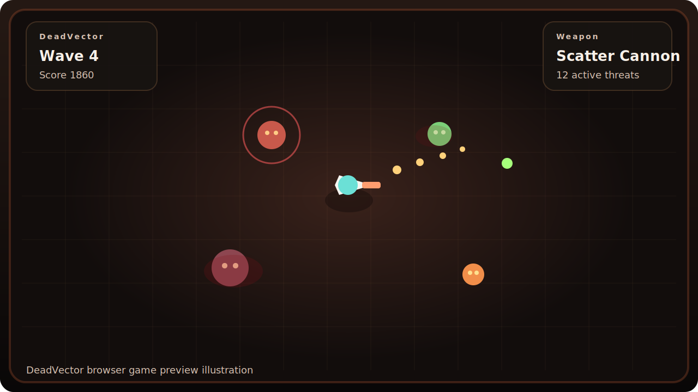

# DeadVector

DeadVector is a browser-based top-down zombie survival arena built with HTML5 Canvas and JavaScript. The project is designed around the assignment brief in [rules.md](./rules.md), with FSM-driven zombie AI, responsive canvas rendering, keyboard and mouse controls, custom game events, menu and HUD screens, and generated audio.

## Gameplay Preview

## How To Play
- Move with `W`, `A`, `S`, `D`
- Aim with mouse movement
- Fire with `click`
- Hold left mouse for automatic fire with the SMG
- Switch weapons with the mouse wheel or `1`, `2`, `3`
- Dash with right click
- Pause with `Escape`
- Toggle mute with `M` or the mute button

## Implemented Event Types
- `load`
- `keydown`
- `keyup`
- `keypress`
- `mousemove`
- `mousedown`
- `mouseup`
- `click`
- `contextmenu`
- `wheel`
- `resize`
- `focus`
- `blur`
- `visibilitychange`
- Custom events: `gameStart`, `waveComplete`, `levelUp`, `gameOver`
- `requestAnimationFrame`
- `setTimeout`
- `setInterval`

## FSM AI Overview
- Every zombie instance is controlled by the reusable FSM in `js/ai/fsm.js`.
- Shared states: `SPAWN`, `WANDER`, `CHASE`, `ATTACK`, `RETREAT`, `DEAD`.
- Zombie variants:
  - `Shambler`: durable melee pressure.
  - `Sprinter`: fast glass-cannon melee attacker.
  - `Spitter`: ranged zombie that kites and fires acid shots.
  - `Brute`: slow heavy unit with large health and damage.
  - `Screamer`: ranged support caster that buffs nearby allies with a speed aura.

## Documentation
- FSM diagram: [docs/fsm-diagram.md](./docs/fsm-diagram.md)
- FSM transition table: [docs/fsm-table.md](./docs/fsm-table.md)
- Assignment summary: [rules.md](./rules.md)

## FSM Diagram

## Technologies Used
- HTML5
- CSS3
- JavaScript ES6 modules
- Canvas 2D API
- Web Audio API

## Run Locally
- Open `index.html` in a modern browser, or serve the folder with a static server for best module support.

## GitHub Pages
- Add your GitHub Pages URL here after deployment.
