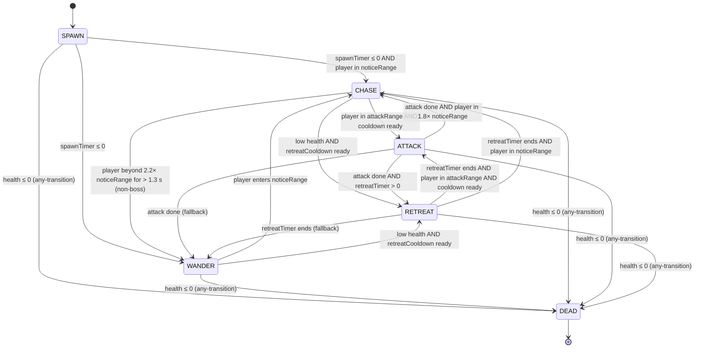

# DeadVector FSM Diagram

## Mermaid Source

## State Notes
- `SPAWN`: short entry telegraph when a zombie arrives, with a pulsing ring.
- `WANDER`: idle roaming state that picks a random arena target.
- `CHASE`: direct pursuit or ranged repositioning around the player. Sprinters show speed streaks.
- `ATTACK`: windup telegraph (red ring) plus melee strike or ranged projectile.
- `RETREAT`: low-health disengage state with a dashed ring visual.
- `DEAD`: death burst, blood decal, health pickup chance, and corpse fade-out.

## Shared Rule
- Any zombie can transition to `DEAD` when health reaches zero.

## Enemy Variants
| Type | Role | Key Trait |
| --- | --- | --- |
| Shambler | Melee tank | Wobbling arms, slow but steady |
| Sprinter | Fast rusher | Speed streaks, low HP |
| Spitter | Ranged acid | Bloated body, acid drip projectiles |
| Brute | Heavy tank | Armored plates, high damage |
| Screamer | Support caster | Aura buffs nearby allies, ranged purple orbs |
